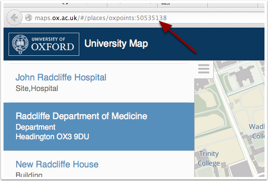
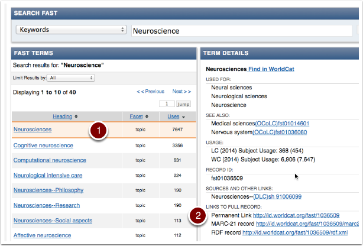

How to find IDs for locations, units and topics
===============================================

To get a customized listing to display in the embed widget, you need to supply Oxpoints (locations/units) and FAST (topic) IDs. There are several ways to find these.

Inspecting Oxford Talks URLs
----------------------------

.. image:: images/find-ids/inspecting-oxford-talks-urls.png
   :alt: Inspecting Oxford Talks URLs
   :height: 459px
   :width: 476px
   :align: center

The simplest way is to look in Oxford Talks.

If you can find a talk assigned to the department or topic you are interested in, then hovering over, or clicking, the links will allow you to extract the ID from the URL:

::

     http://talks.ox.ac.uk/talks/topics/id/?\ **uri=http://id.worldcat.org/fast/1036509**
     http://talks.ox.ac.uk/talks/department/id/\ **oxpoints:23232612** 

If you can't find what you're looking for  - there are some other options:

Searching for Oxpoints IDs
--------------------------

Search `http://maps.ox.ac.uk <http://maps.ox.ac.uk>`_ for the location or department. The address in your browser address bar will contain the Oxpoints ID.

Alternatively, use the Mobile Oxford API `(http://api.m.ox.ac.uk) <(http://api.m.ox.ac.uk)>`_ e.g:

::

     http://api.m.ox.ac.uk/places/search?q=radcliffe

Searching for Topics
--------------------

Search via the Online Computer Library Center interface: `http://fast.oclc.org/searchfast/ <http://fast.oclc.org/searchfast/>`_

#. Identify the term you want to use
#. Then locate the **Permanent Link** under **Links to Full Record**

Alternatively, the Talks API provides a search for Topics e.g.:

::

     http://talks.ox.ac.uk/topics/search?q=neuroscience

