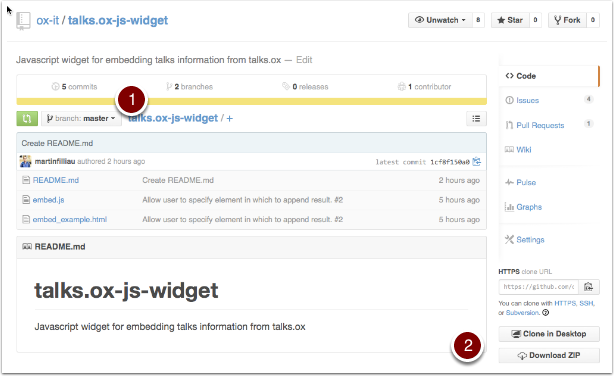

Downloading from Github
=======================

The embed widget javascript and example html page are available on Github - this is a repository of code which makes it easier for developers to collaborate and store versions of their work. 

Download ZIP
------------

#. Make sure the **branch** is set to **master** 
#. Click the **Download ZIP** button 